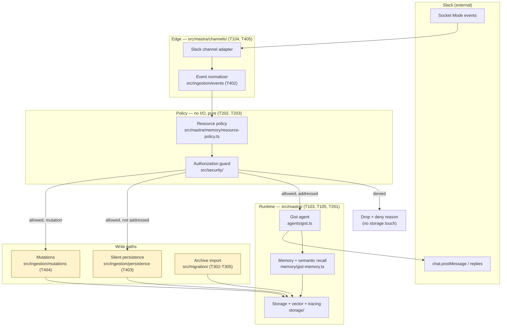

# Gist on Mastra — runtime architecture

- **Contract version:** 1.0.0
- **Status:** Frozen at T004 merge. Changes require coordinator approval (see [`contracts/README.md`](./contracts/README.md)).
- **Date:** 2026-08-30
- **Owner:** T004 (claude-planner); after merge, coordinator
- **Sources:** [`GIST_MASTRA_PRD.md`](../../GIST_MASTRA_PRD.md), [`MASTRA_MIGRATION_PLAN.md`](../../MASTRA_MIGRATION_PLAN.md), [`DECISIONS.md`](../implementation/DECISIONS.md) D001–D010 (all Accepted)

This document freezes component boundaries and the direction of every dependency. It defines **what each component may import and must export**, not how any of it is implemented. Implementation belongs to P01–P04.

## 1. Design invariants

These are derived from accepted decisions and PRD requirements. Every contract in [`contracts/`](./contracts/) enforces at least one. A change to any invariant is a decision amendment, not a task-level design choice.

| # | Invariant | Source |
|---|---|---|
| INV-1 | Deny by default. Every gate — accept event, write memory, read memory, generate — requires a positive authorization result. Absence of a decision denies. | D001, D006, NFR-SEC-004 |
| INV-2 | Authorization runs **before** storage lookup, retrieval, and generation. No component may read or write memory before an `AuthorizationDecision` with `allowed: true`. | D005, D006, FR-PRV-005 |
| INV-3 | A DM resource identity can never resolve to a channel resource identity, or vice versa. Isolation is structural in the ID space, not a runtime filter. | D002, FR-PRV-003/004 |
| INV-4 | DM content is never written to a channel boundary. There is no code path, flag, or configuration that enables it. | D002, FR-PRV-004 |
| INV-5 | Under `GIST_DM_SHARED_KNOWLEDGE=false` (the accepted default), a DM retrieval request returns only that DM's own boundary. | D002 |
| INV-6 | Silent ingestion never invokes the generation model. Ingestion and generation are separate entry points with no shared call path. | UJ4, FR-MEM-008, NFR-PERF-004 |
| INV-7 | Retrieval is not a model-callable tool. It executes before generation and its output enters the prompt as context. No tool, shell command, or function definition exposes it to the model. | FR-MEM-003/004, NFR-MNT-002 |
| INV-8 | Every retrieved item carries `sender_name`, `sent_at`, and `boundary_id`. A retrieval result without them cannot satisfy the citation requirement and is a contract violation. | D009 |
| INV-9 | Deleting a message deletes its embedding in the same operation. An embedding may never outlive its source record. | D004, D005 |
| INV-10 | Message identity is `(workspace_id, channel_id, message_ts)`. Every write is idempotent on it; replay is a no-op success. | FR-SLK-008, FR-MEM-007, NFR-REL-002 |
| INV-11 | Nothing user-facing exposes internal identifiers, storage paths, prompts, traces, or stack traces. | FR-RSP-007/008 |
| INV-12 | Message bodies, tokens, and DM content never enter standard application logs. | FR-PRV-008 |

## 2. Component map



Shaded write paths (`ING`, `MUT`, `IMP`) **must not import the agent or any model client** (INV-6). This is a mechanical check available to T502: the persistence, mutations, and migration modules may not have `agents/` or a provider SDK in their import graph.

## 3. Dependency direction

Dependencies point inward. Policy is the innermost layer and imports nothing from the layers around it.

```
edge (channels, event normalization)
  ↓ depends on
policy (resource-policy, security)      ← pure, no I/O, no framework imports
  ↑ depended on by
runtime (agent, memory, storage) and write paths (ingestion, migration)
```

Rules:

1. **Policy imports nothing from `edge`, `runtime`, or write paths.** `resource-policy.ts` and `src/security/**` are pure functions over plain data. They are unit-testable with no Mastra instance, no database, and no network. This is what lets T202 and T203 run in parallel with T201.
2. **`edge` never writes storage directly.** It normalizes and hands off. All writes go through `runtime` or a declared write path.
3. **Write paths never import `agents/`.** (INV-6)
4. **No component imports another task's test files or fixtures**, except from `contracts/fixtures/` which is shared and versioned.
5. **Slack SDK types stop at `edge`.** Past the normalizer, every component speaks the normalized contract in [`contracts/slack-event.md`](./contracts/slack-event.md) — so retrieval, memory, and authorization have no Slack coupling and stay testable with plain objects.

## 4. Request paths

### 4.1 Addressed request (DM or mention) — generation permitted

1. Adapter receives the Slack event and derives an idempotency key (INV-10).
2. Normalizer produces a `NormalizedEvent`.
3. Resource policy resolves `ResourceIdentity` (INV-3).
4. Authorization guard returns an `AuthorizationDecision` (INV-1, INV-2). On deny: drop, record the deny reason, touch no storage.
5. Retrieval runs automatically, scoped to the authorized boundary set (INV-5, INV-7).
6. Agent generates with retrieved context in the prompt; response streams to the originating thread.
7. The user turn and the agent turn persist to the conversation's own boundary.

### 4.2 Silent ingestion (ordinary channel message) — generation forbidden

Steps 1–4 identical. Then: persist to the channel boundary and embed. **No model call, no reply, no typing indicator** (INV-6). A single human message in an approved channel produces exactly one stored record and zero model invocations.

### 4.3 Mutation (edit / delete)

Steps 1–4 identical — authorization precedes lookup, so a mutation for an unapproved channel is denied without revealing whether the record exists (D005). Then apply per [`contracts/slack-event.md`](./contracts/slack-event.md) §4: edit updates text and re-embeds; delete removes record and embedding together (INV-9) leaving a content-free tombstone.

### 4.4 Archive import

Runs offline, outside the Slack request path. Same identity, boundary, and idempotency contracts (INV-10), so a message imported from the archive and the same message arriving live converge on one record. The import contract itself is **T301's deliverable**, not T004's — see the reservation in [`contracts/README.md`](./contracts/README.md).

## 5. Where generation is forbidden

Required by implementation step 4 of the task, and mechanically checkable.

| Path | Generation | Enforcement |
|---|---|---|
| Silent ingestion (`src/ingestion/persistence/**`) | **Forbidden** | No agent/provider import; T403 test asserts zero model calls for an ordinary message |
| Mutations (`src/ingestion/mutations/**`) | **Forbidden** | Re-embedding on edit uses the *embedding* provider only — never the generation model |
| Archive import (`src/migration/**`) | **Forbidden** | Import is embedding-only; T305 asserts no generation client is constructed |
| Authorization (`src/security/**`) | **Forbidden** | Pure functions; a deny decision must never cost a model call |
| Resource policy (`src/mastra/memory/resource-policy.ts`) | **Forbidden** | Pure functions |
| Addressed request (`src/mastra/agents/**`) | **Permitted** | The only permitted path |

Re-embedding is not generation. The embedding provider (D008) is reachable from write paths; the generation provider (D007) is not.

## 6. Component interfaces

Signatures are TypeScript-shaped for precision. Types live in the contract files; this table fixes ownership and direction only.

| Component | Owner | Imports | Must export |
|---|---|---|---|
| Slack channel adapter | T104, T405 | Mastra Channels, normalizer | Adapter registration; delivery of `RawSlackEvent` |
| Event normalizer | T402 | contract types only | `normalize(raw): NormalizedEvent \| SkipReason` |
| Resource policy | T202 | contract types only | `resolveIdentity(e: NormalizedEvent): ResourceIdentity`; `boundaryIdFor(i: ResourceIdentity): BoundaryId` |
| Authorization guard | T203 | contract types, config | `authorize(req: AuthorizationRequest): AuthorizationDecision`; `retrievalScope(d: AuthorizationDecision): BoundaryId[]` |
| Memory / recall | T201 | Mastra Memory, storage | Configured memory instance; `RetrievedItem[]` shaped per contract |
| Storage / tracing | T103 | Mastra storage, libSQL | Store + vector store handles; trace config |
| Gist agent | T105 | memory, storage, model provider | Configured agent; persona and policy independently testable (NFR-MNT-003) |
| Silent persistence | T403 | storage, contract types | `persist(e: NormalizedEvent, i: ResourceIdentity): PersistResult` |
| Mutations | T404 | storage, contract types | `applyMutation(m: MutationEvent): MutationResult` |
| Migration | T302–T305 | storage, contract types | Reader / mapper / writer per T301's import contract |

## 7. Storage topology

Per D010 and the migration plan: file-backed libSQL store plus libSQL vector store for single-process deployment; a managed database with restricted network access if the service becomes multi-instance. The database file lives outside the repository and is never committed (FR-PRV-007). Vector dimension is **1536**, fixed by D008 and stated in [`contracts/storage.md`](./contracts/storage.md) so a mismatch fails at startup rather than at query time.

Traces are treated as a second sensitive store carrying message content (R7, D010): operator-restricted, 30-day retention (D004), and correlated to a Slack event by run ID without logging message bodies (NFR-OBS-003).

## 8. Known limitations recorded at freeze time

1. **Adapter event support is unverified.** Whether the pinned Mastra Channels version surfaces ordinary channel messages and `message_changed`/`message_deleted` subtypes through a supported handler is T401's spike. If it does not, the normalizer contract still holds but the adapter gains a documented event bridge — a T401/T402 concern, not a contract change. Risk R1.
2. **Offline mutation gap.** Edits and deletes occurring while Gist is down are not reconciled (D005, explicitly out of scope for v1).
3. **DM historical recall is intentionally weak** under D002's accepted default. Not a retrieval defect.
4. **Retrieval mechanism may become RAG.** FR-MEM-013 permits pre-generation RAG via a context processor if Memory alone misses archive-scale quality. The retrieval *contract* is written to be mechanism-independent for exactly this reason; switching does not reopen T004 provided INV-7 holds.
