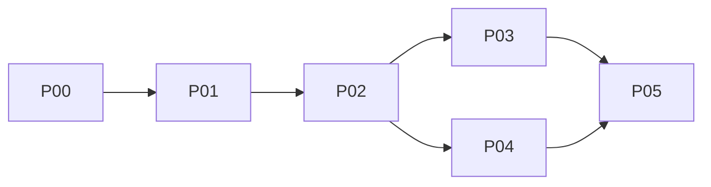
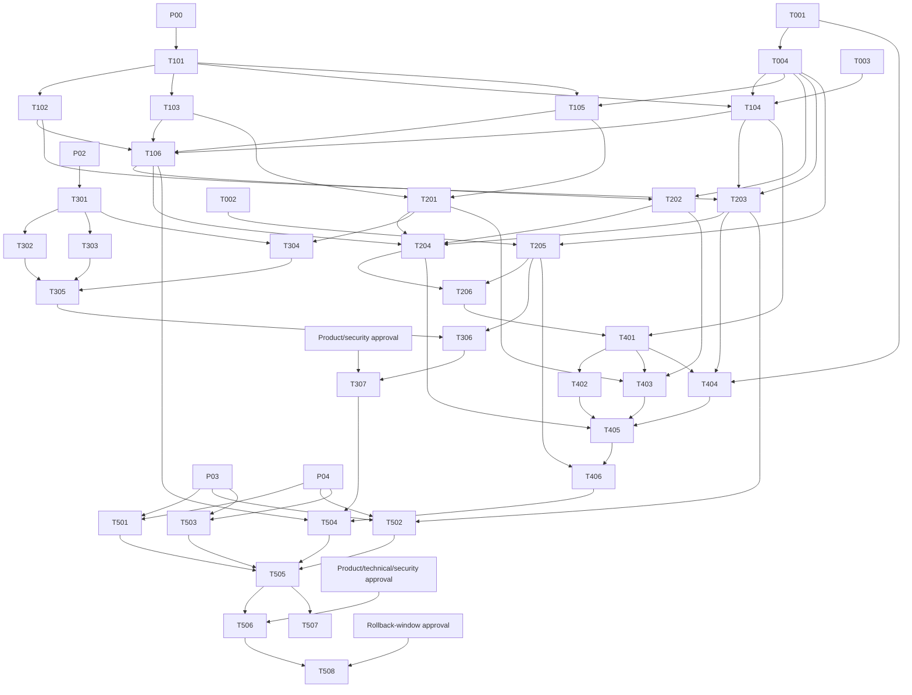

# Dependency and Parallel Execution Graph

Only merged `Completed` tasks satisfy dependencies. Approval dependencies are gates, not coding tasks.

## Phase graph

## Safe execution waves

### W0 — immediate parallel

[T000](./tasks/T000-REPOSITORY-SAFETY.md), [T001](./tasks/T001-PRODUCT-DECISIONS.md), [T002](./tasks/T002-BASELINE-BENCHMARK.md), [T003](./tasks/T003-SLACK-DEV-ENVIRONMENT.md)

### W1 — governance contract

[T004](./tasks/T004-ARCHITECTURE-CONTRACTS.md)

### W2 — exclusive scaffold

[T101](./tasks/T101-PROJECT-SCAFFOLD.md)

### W3 — foundation parallel

[T102](./tasks/T102-CONFIG-VALIDATION.md), [T103](./tasks/T103-STORAGE-TRACING.md), [T104](./tasks/T104-SLACK-CHANNEL.md), [T105](./tasks/T105-GIST-AGENT.md)

### W4 — foundation integration

[T106](./tasks/T106-FOUNDATION-INTEGRATION.md)

### W5 — memory parallel

[T201](./tasks/T201-MEMORY-CONFIG.md), [T202](./tasks/T202-RESOURCE-POLICY.md), [T203](./tasks/T203-ACCESS-PRIVACY.md), [T205](./tasks/T205-RETRIEVAL-BENCHMARK.md)

### W6A — memory integration

[T204](./tasks/T204-MEMORY-INTEGRATION.md)

### W6B — memory validation

[T206](./tasks/T206-MEMORY-VALIDATION.md)

### W7 — parallel phase starts

[T301](./tasks/T301-IMPORT-CONTRACT.md), [T401](./tasks/T401-ADAPTER-EVENT-SPIKE.md)

### W8 — history/live components in parallel

[T302](./tasks/T302-SOURCE-READER.md), [T303](./tasks/T303-MESSAGE-MAPPING.md), [T304](./tasks/T304-MEMORY-WRITER.md), [T402](./tasks/T402-EVENT-NORMALIZATION.md), [T403](./tasks/T403-SILENT-PERSISTENCE.md), [T404](./tasks/T404-MUTATION-POLICY.md)

### W9 — subsystem integrations

[T305](./tasks/T305-IMPORT-ORCHESTRATION.md), [T405](./tasks/T405-LIVE-INTEGRATION.md)

### W10 — subsystem validation

[T306](./tasks/T306-SAMPLE-IMPORT.md), [T406](./tasks/T406-LIVE-VALIDATION.md)

### W11 — full import

[T307](./tasks/T307-FULL-IMPORT.md)

### W12 — release gates in parallel

[T501](./tasks/T501-E2E-ACCEPTANCE.md), [T502](./tasks/T502-SECURITY-REVIEW.md), [T503](./tasks/T503-PERFORMANCE-OBSERVABILITY.md), [T504](./tasks/T504-DEPLOYMENT-RUNBOOK.md)

### W13 — beta

[T505](./tasks/T505-BETA-RELEASE.md)

### W14 — production and handover

[T506](./tasks/T506-PRODUCTION-CUTOVER.md), [T507](./tasks/T507-HANDOVER.md)

### W15 — post-window cleanup

[T508](./tasks/T508-LEGACY-CLEANUP.md)

## Critical path

`T001 → T004 → T101 → T104/T105 → T106 → T201/T202/T203 → T204 → T206 → T301 → T302/T303/T304 → T305 → T306 → T307 → T501–T504 → T505 → T506 → T508`

P04 runs alongside P03 after P02. P05 waits for both. T507 can overlap production observation after beta.

## Task dependency edges

## Conflict prevention

- Tasks in one parallel group have disjoint primary write scopes.
- Shared composition is delayed to T106, T204, and T405.
- Package/lock/config cleanup is exclusive to T101 then T508.
- Phase/status/global-log edits are serialized through phase integrator.
- Operational tasks T306, T307, T505, and T506 are serialized approvals, not parallel coding work.

See [`FILE_OWNERSHIP.md`](./FILE_OWNERSHIP.md) for path locks.
